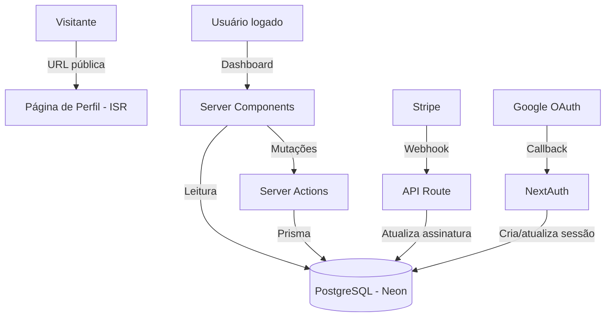
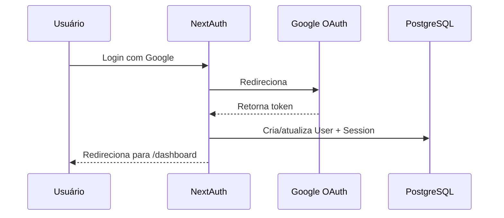
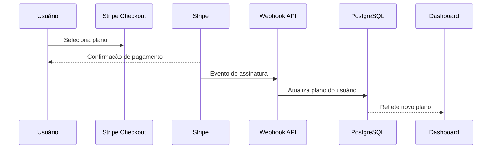

# BioflowGO - Link-in-Bio para Profissionais

<p align="center">
  
</p>


> Uma aplicação SaaS full-stack moderna que reúne seu trabalho, projetos e redes sociais em uma única página compartilhável, construída como alternativa localizada ao Linktree para o mercado brasileiro.

**Acesse:** [bioflowgo.com.br](https://bioflowgo.com.br) · **Função:** Desenvolvedor Solo · **Ano:** [2026]

---

## Visão Geral

BioflowGO é uma plataforma SaaS de "link na bio" que permite criar uma página de presença digital profissional, reunindo redes sociais, projetos de portfólio e URLs personalizadas em um único link compartilhável.

O produto é voltado para o mercado brasileiro, oferecendo um modelo freemium com UX em pt-BR, preços em BRL e funcionalidades pensadas para freelancers, criadores de conteúdo e profissionais digitais.

---

## Problema

Profissionais digitais no Brasil dependiam principalmente de ferramentas em inglês como o Linktree, que não ofereciam:
- UX nativa em português brasileiro
- Layout com foco em portfólio (projetos como cidadãos de primeira classe)
- Onboarding e precificação localizados

---

## Solução

Uma plataforma SaaS completamente customizada, construída do zero, onde os usuários podem:

- Criar uma ou mais páginas de bio link em uma URL personalizada (`bioflowgo.com.br/usuario`)
- Adicionar perfis de redes sociais, projetos de portfólio com imagens e links personalizados
- Customizar o cartão do perfil (cores, foto, nome de exibição)
- Acompanhar o engajamento de visitantes via dashboard de métricas
- Gerar um QR Code da página
- Gerenciar assinatura e cobrança

---

## Stack de Tecnologias

| Camada       | Tecnologia                              |
|--------------|-----------------------------------------|
| Framework    | Next.js 15 (App Router, Server Actions) |
| Linguagem    | TypeScript                              |
| Estilização  | Tailwind CSS + shadcn/ui                |
| Animações    | GSAP, Motion (Framer Motion)            |
| Banco de Dados | PostgreSQL                            |
| ORM          | Prisma                                  |
| Autenticação | NextAuth.js (Google OAuth)              |
| Pagamentos   | Stripe (assinaturas)                    |
| Hospedagem   | Vercel                                  |
| Analytics    | Google Analytics 4                      |
| Gráficos     | Recharts                                |

---

## Arquitetura

A aplicação segue uma estrutura **monorepo Next.js** com App Router, com separação clara entre rotas públicas e rotas autenticadas do dashboard.

```
app/
├── [profileId]/         # Páginas de perfil públicas (SSR)
├── dashboard/           # Área autenticada do usuário
├── metrics/             # Dashboard de analytics
├── account-settings/    # Cobrança e gerenciamento de conta
├── api/                 # Rotas de API (auth, webhooks Stripe, CRUD de perfil)
├── actions/             # Server Actions (mutações)
├── components/          # Componentes de funcionalidade e UI
└── lib/                 # Utilitários e helpers compartilhados
```


### Estratégia de Renderização por Rota

| Rota                | Estratégia | Motivo                                            |
|---------------------|------------|---------------------------------------------------|
| `/[profileId]`      | ISR        | Performance para visitantes, dados sempre frescos |
| `/dashboard`        | SSR        | Dados privados, requer sessão autenticada         |
| `/metrics`          | SSR        | Dados em tempo real por usuário                   |
| `/` (landing page)  | SSG        | Conteúdo estático, máxima performance             |

### Separação de Responsabilidades

- **Server Components** — leitura de dados diretamente do banco via Prisma (sem camada de API)
- **Server Actions** — todas as mutações (criar, editar, deletar perfil, links, projetos)
- **Client Components** — interatividade, formulários, upload de imagens com compressão
- **API Routes** — exclusivamente para webhooks externos (Stripe, NextAuth)

### Fluxo de Dados



### Fluxo de Autenticação



### Fluxo de Assinatura



**Principais decisões arquiteturais:**

- **Server Actions** para todas as mutações, elimina a necessidade de endpoints de API separados para CRUD, mantendo o código enxuto
- **Neon (PostgreSQL serverless)** para conexões de banco sem cold-start na Vercel
- **Prisma** para queries com tipagem segura e migrações orientadas a schema
- **NextAuth** com adaptador de banco de dados para sessões persistentes vinculadas ao modelo de usuário
- **Stripe Webhooks** para sincronizar o estado da assinatura de volta ao banco de dados

---

## Funcionalidades Principais

### Página de Perfil Pública
Cada usuário recebe uma URL única. A página é renderizada no servidor (SSR) para performance de SEO, exibindo o cartão de perfil, links sociais, projetos de portfólio e links personalizados.

### Dashboard
Área autenticada onde os usuários gerenciam seus perfis, fazem upload de imagens (com compressão no cliente via `browser-image-compression`) e configuram o layout da página.

### Métricas
Dashboard de analytics de visitantes exibindo:
- Total de visitas à página ao longo do tempo
- Engajamento por projeto
- Tendência de visitas nos últimos 7 dias (gráfico de linha)

### Assinaturas
Modelo freemium com Stripe. Usuários do plano gratuito têm limites no número de perfis e links personalizados. Planos pagos desbloqueiam limites maiores. A cobrança é gerenciada diretamente via portal do cliente Stripe.

### Onboarding
Novos usuários são guiados pela criação do perfil com um tour interativo pelo produto (driver.js) e tooltips contextuais, reduzindo o tempo para o primeiro valor após o cadastro.

---

## Desafios e Soluções

### Desafio 1 — Performance da Página de Perfil
As páginas de perfil públicas precisam carregar rápido, pois são compartilhadas via bio do Instagram. A latência de cold-start das funções serverless era uma preocupação.

**Solução:** Uso do ISR (Incremental Static Regeneration) do Next.js para as páginas de perfil, com revalidação sob demanda disparada quando o usuário atualiza o perfil. Isso entrega performance de arquivo estático para os visitantes, mantendo os dados sempre atualizados.

---

### Desafio 2 — Upload de Imagens Sem Armazenamento Dedicado
Evitar a complexidade de um serviço de armazenamento de objetos separado (S3/R2) para o MVP.

**Solução:** As imagens são comprimidas no cliente (reduzindo o tamanho em ~70–80% em média) e armazenadas como base64 no banco de dados na versão inicial. Isso simplificou significativamente a arquitetura para o MVP, mantendo o uso dentro dos limites de armazenamento da Neon.

---

### Desafio 3 — Sincronização do Estado de Assinatura
Os eventos do Stripe chegam de forma assíncrona via webhooks, criando uma janela onde o banco de dados pode estar desatualizado em relação ao status real da assinatura do usuário.

**Solução:** Implementação de handlers de webhook idempotentes que mapeiam os tipos de evento do Stripe para atualizações específicas no banco de dados, usando o `stripe_customer_id` como chave de ligação entre o Stripe e o modelo de usuário. As verificações de assinatura sempre leem do banco de dados, que é a única fonte de verdade.

---

## Resultados

- [X] Lançado em produção em [bioflowgo.com.br](https://bioflowgo.com.br)
- [X] Fluxo completo de assinatura Stripe funcionando (planos gratuito e pago)
- [X] Autenticação via Google OAuth
- [X] Dashboard de métricas de visitantes para usuários registrados
- [ ] [Item do roadmap — ex: suporte a domínio customizado]
- [ ] [Item do roadmap — ex: marketplace de temas]

---

## O Que Aprendi

- **Propriedade ponta a ponta de um SaaS:** cuidar de tudo, desde autenticação e pagamentos até UX e deploy, me deu uma visão muito mais profunda de onde a complexidade realmente mora em um produto (spoiler: nos edge cases de cobrança).
- **Server Actions vs. Rotas de API:** usar Server Actions para mutações reduziu drasticamente o boilerplate, mas exigiu disciplina com revalidação para manter a UI sincronizada.
- **Lançar é melhor do que perfeccionar:** a arquitetura tem trade-offs conhecidos (ex: imagens em base64) aceitáveis para um MVP. Documentá-los explicitamente torna o caminho para a melhoria mais claro.

---

## Rodando Localmente

```bash
# Clone o repositório
git clone https://github.com/----
cd bioflowgo

# Instale as dependências
npm install

# Configure as variáveis de ambiente
cp .env.example .env.local
# → Preencha DATABASE_URL, NEXTAUTH_SECRET, GOOGLE_CLIENT_ID, STRIPE_SECRET_KEY, etc.

# Aplique o schema no banco
npx prisma db push

# Inicie o servidor de desenvolvimento
npm run dev

```

## Autor

**Renan Montanari** - [github.com/renawmontanari](https://github.com/renawmontanari) · **LinkedIn** - [https://linkedin.com/in/renan-w-montanari](https://www.linkedin.com/in/renan-w-montanari/) · **BioflowGO** - [bioflowgo.com.br](https://bioflowgo.com.br)

---

*Construído com Next.js, Prisma, Stripe e muito café.*

